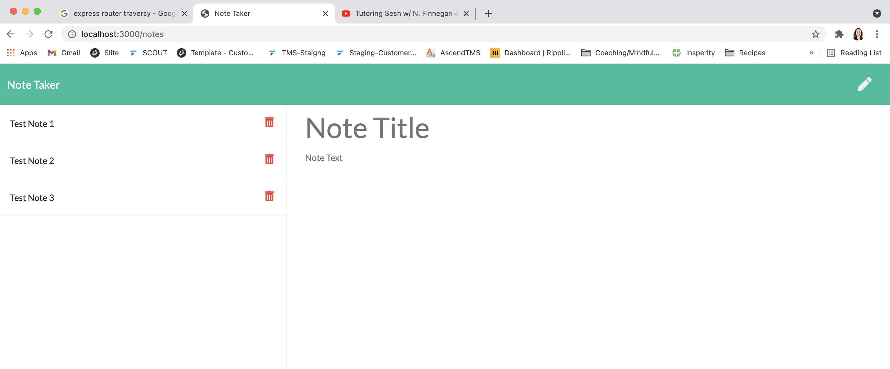

# note_taker

## Description 📁

This application allows a user to keep track of tasks needing to be complete. You have the ability to add a new note and delete an existing once once it's complete. If you want to read what the subtext of your note was, you can click back into it on the left hand side of the page and it will pop up on the right side in more detail.This project involved start code which was the HTML and index.js files, the front end was built out and we were tasked with building and connecting the back end. We learned Express.js in this previous sprint and that was leveraged heavily to complete this application.

## Technologies Used 💻

- Node.js
- JavaScript
- Express.js

## Preview

- Video Demo: https://youtu.be/rUu5AgAt_Ko
- Screen Shot of final product:
  

## Resources 💡

In addition to help and support from the TAs & my tutor, I found the below videos/articles to be helpful

- https://stackoverflow.com/questions/36093042/how-do-i-add-to-an-existing-json-file-in-node-js
- https://www.youtube.com/watch?v=L72fhGm1tfE

## Future Development

- Add validator to ensure there are no duplicate ID numbers stored on the backend
- Allow a user to update a previously entered note

## License

This project is covered under the MIT license.
